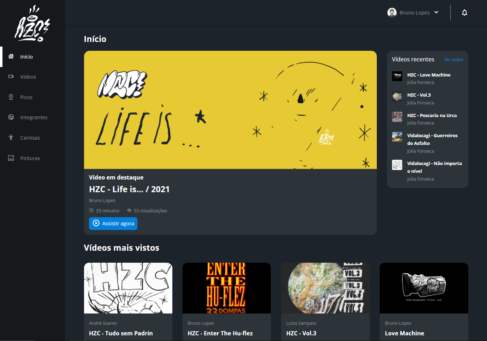
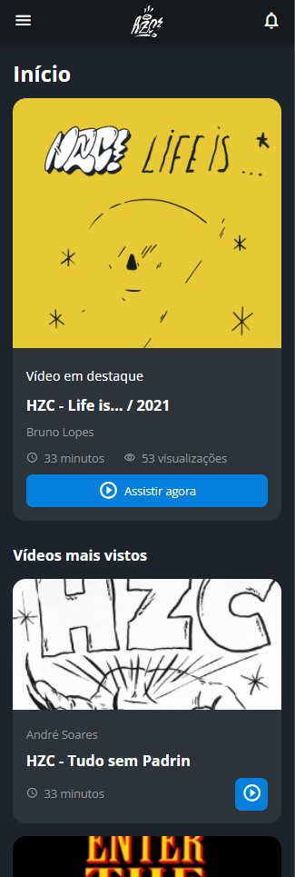

<h1>CSS: dispondo elementos com Flexbox e Grid | Alura</h1>

Repositório com material de estudo do curso CSS: dispondo elementos com Flexbox e Grid da Alura Escola Online de Tecnologia.

A proposta deste treinamento é entender o uso e limitações do display: flex e display: grid.

<h2>:file_folder: Projeto HZC</h2> 

  

 

A HZC é uma comunidade de skate fictícia.

Para este treinamento foram desenvolvidas as versões mobile e desktop do site, com base no layout disponibilizado no Figma.

    
    

 

Neste projeto foi utilizada a metodologia de escrita BEM e componentes de CSS para reuso.

<h2>:computer: Tecnologias utilizadas</h2>

    
    
    

